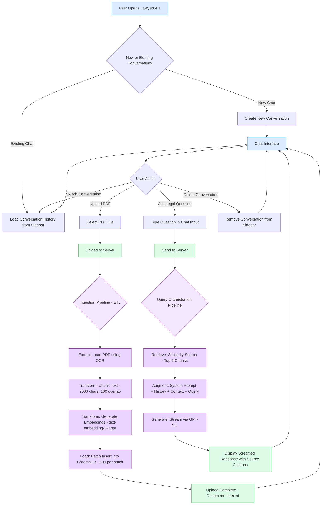

# LawyerGPT - User Flow Diagram

```mermaid
flowchart TD
    A["User Opens LawyerGPT"] --> B{"New or Existing Conversation?"}

    B -->|"New Chat"| C["Create New Conversation"]
    B -->|"Existing Chat"| D["Load Conversation History from Sidebar"]

    C --> E["Chat Interface"]
    D --> E

    E --> F{"User Action"}

    F -->|"Upload PDF"| G["Select PDF File"]
    G --> H["Upload to Server"]
    H --> I{"Ingestion Pipeline - ETL"}

    I --> I1["Extract: Load PDF using OCR"]
    I1 --> I2["Transform: Chunk Text - 2000 chars, 100 overlap"]
    I2 --> I3["Transform: Generate Embeddings - text-embedding-3-large"]
    I3 --> I4["Load: Batch Insert into ChromaDB - 100 per batch"]
    I4 --> I5["Upload Complete - Document Indexed"]
    I5 --> E

    F -->|"Ask Legal Question"| N["Type Question in Chat Input"]
    N --> O["Send to Server"]
    O --> P{"Query Orchestration Pipeline"}

    P --> P1["Retrieve: Similarity Search - Top 5 Chunks"]
    P1 --> P2["Augment: System Prompt + History + Context + Query"]
    P2 --> P3["Generate: Stream via GPT-5.5"]
    P3 --> P4["Display Streamed Response with Source Citations"]
    P4 --> E

    F -->|"Switch Conversation"| D
    F -->|"Delete Conversation"| U["Remove Conversation from Sidebar"]
    U --> E

    style A fill:#dbeafe,stroke:#1971c2
    style E fill:#dbeafe,stroke:#1971c2
    style I fill:#f3e8ff,stroke:#9c36b5
    style P fill:#f3e8ff,stroke:#9c36b5
    style I1 fill:#e9d5ff,stroke:#9c36b5
    style I2 fill:#e9d5ff,stroke:#9c36b5
    style I3 fill:#e9d5ff,stroke:#9c36b5
    style I4 fill:#e9d5ff,stroke:#9c36b5
    style I5 fill:#dcfce7,stroke:#2f9e44
    style P1 fill:#e9d5ff,stroke:#9c36b5
    style P2 fill:#e9d5ff,stroke:#9c36b5
    style P3 fill:#e9d5ff,stroke:#9c36b5
    style P4 fill:#dcfce7,stroke:#2f9e44
    style H fill:#dcfce7,stroke:#2f9e44
    style O fill:#dcfce7,stroke:#2f9e44
```
