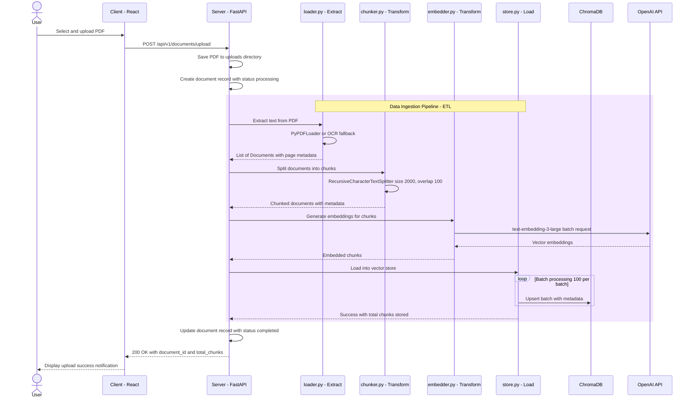

# LawyerGPT - Document Upload Sequence Diagram (Ingestion)

```mermaid
sequenceDiagram
    actor User
    participant Client as Client - React
    participant Server as Server - FastAPI
    participant Loader as loader.py - Extract
    participant Chunker as chunker.py - Transform
    participant Embedder as embedder.py - Transform
    participant Store as store.py - Load
    participant ChromaDB
    participant OpenAI as OpenAI API

    User->>Client: Select and upload PDF
    Client->>Server: POST /api/v1/documents/upload
    Server->>Server: Save PDF to uploads directory
    Server->>Server: Create document record with status processing

    rect rgb(243, 232, 255)
        Note over Loader,Store: Data Ingestion Pipeline - ETL

        Server->>Loader: Extract text from PDF
        Loader->>Loader: PyPDFLoader or OCR fallback
        Loader-->>Server: List of Documents with page metadata

        Server->>Chunker: Split documents into chunks
        Chunker->>Chunker: RecursiveCharacterTextSplitter size 2000, overlap 100
        Chunker-->>Server: Chunked documents with metadata

        Server->>Embedder: Generate embeddings for chunks
        Embedder->>OpenAI: text-embedding-3-large batch request
        OpenAI-->>Embedder: Vector embeddings
        Embedder-->>Server: Embedded chunks

        Server->>Store: Load into vector store
        loop Batch processing 100 per batch
            Store->>ChromaDB: Upsert batch with metadata
        end
        Store-->>Server: Success with total chunks stored
    end

    Server->>Server: Update document record with status completed
    Server-->>Client: 200 OK with document_id and total_chunks
    Client-->>User: Display upload success notification
```
