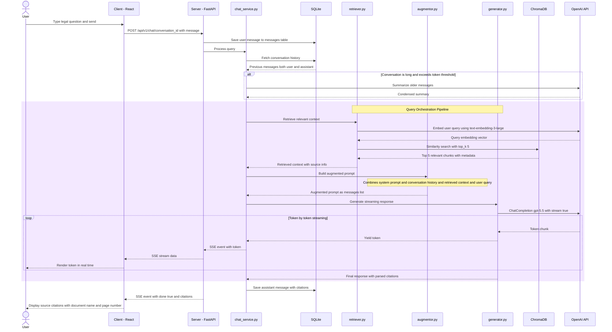

# LawyerGPT - Chat Query Sequence Diagram (RAG Flow)

```mermaid
sequenceDiagram
    actor User
    participant Client as Client - React
    participant Server as Server - FastAPI
    participant ChatSvc as chat_service.py
    participant DB as SQLite
    participant Retriever as retriever.py
    participant Augmentor as augmentor.py
    participant Generator as generator.py
    participant ChromaDB
    participant OpenAI as OpenAI API

    User->>Client: Type legal question and send
    Client->>Server: POST /api/v1/chat/conversation_id with message

    Server->>DB: Save user message to messages table
    Server->>ChatSvc: Process query

    ChatSvc->>DB: Fetch conversation history
    DB-->>ChatSvc: Previous messages both user and assistant

    alt Conversation is long and exceeds token threshold
        ChatSvc->>OpenAI: Summarize older messages
        OpenAI-->>ChatSvc: Condensed summary
    end

    rect rgb(243, 232, 255)
        Note over Retriever,Generator: Query Orchestration Pipeline

        ChatSvc->>Retriever: Retrieve relevant context
        Retriever->>OpenAI: Embed user query using text-embedding-3-large
        OpenAI-->>Retriever: Query embedding vector
        Retriever->>ChromaDB: Similarity search with top_k 5
        ChromaDB-->>Retriever: Top 5 relevant chunks with metadata
        Retriever-->>ChatSvc: Retrieved context with source info

        ChatSvc->>Augmentor: Build augmented prompt
        Note over Augmentor: Combines system prompt and conversation history and retrieved context and user query
        Augmentor-->>ChatSvc: Augmented prompt as messages list

        ChatSvc->>Generator: Generate streaming response
        Generator->>OpenAI: ChatCompletion gpt-5.5 with stream true

        loop Token by token streaming
            OpenAI-->>Generator: Token chunk
            Generator-->>ChatSvc: Yield token
            ChatSvc-->>Server: SSE event with token
            Server-->>Client: SSE stream data
            Client-->>User: Render token in real time
        end

        Generator-->>ChatSvc: Final response with parsed citations
    end

    ChatSvc->>DB: Save assistant message with citations
    Server-->>Client: SSE event with done true and citations
    Client-->>User: Display source citations with document name and page number
```
