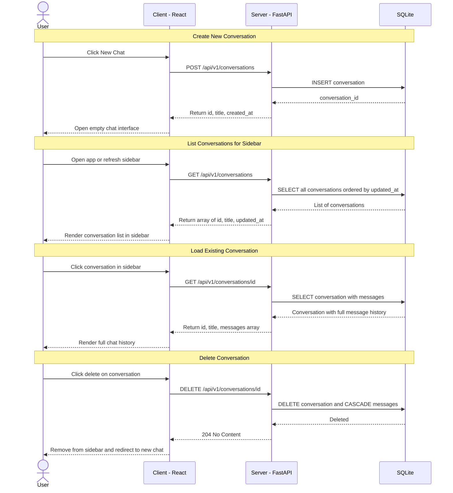

# LawyerGPT - Conversation Management Sequence Diagram

```mermaid
sequenceDiagram
    actor User
    participant Client as Client - React
    participant Server as Server - FastAPI
    participant DB as SQLite

    Note over User,DB: Create New Conversation
    User->>Client: Click New Chat
    Client->>Server: POST /api/v1/conversations
    Server->>DB: INSERT conversation
    DB-->>Server: conversation_id
    Server-->>Client: Return id, title, created_at
    Client-->>User: Open empty chat interface

    Note over User,DB: List Conversations for Sidebar
    User->>Client: Open app or refresh sidebar
    Client->>Server: GET /api/v1/conversations
    Server->>DB: SELECT all conversations ordered by updated_at
    DB-->>Server: List of conversations
    Server-->>Client: Return array of id, title, updated_at
    Client-->>User: Render conversation list in sidebar

    Note over User,DB: Load Existing Conversation
    User->>Client: Click conversation in sidebar
    Client->>Server: GET /api/v1/conversations/id
    Server->>DB: SELECT conversation with messages
    DB-->>Server: Conversation with full message history
    Server-->>Client: Return id, title, messages array
    Client-->>User: Render full chat history

    Note over User,DB: Delete Conversation
    User->>Client: Click delete on conversation
    Client->>Server: DELETE /api/v1/conversations/id
    Server->>DB: DELETE conversation and CASCADE messages
    DB-->>Server: Deleted
    Server-->>Client: 204 No Content
    Client-->>User: Remove from sidebar and redirect to new chat
```
