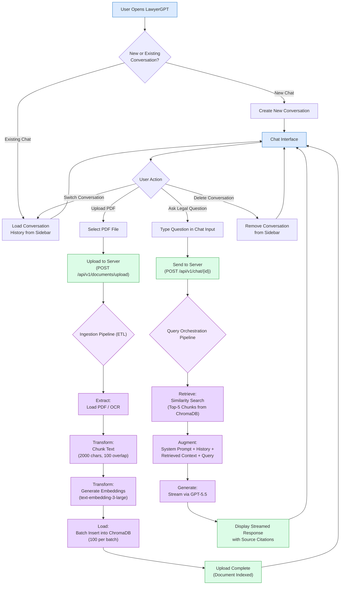
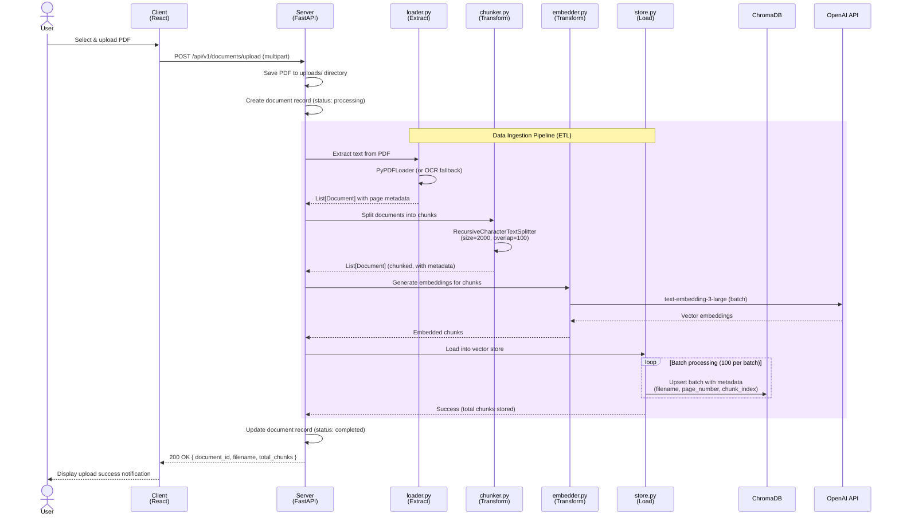
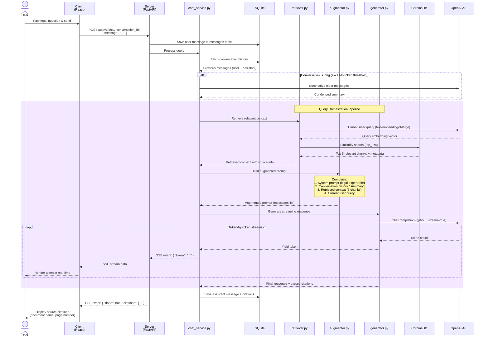
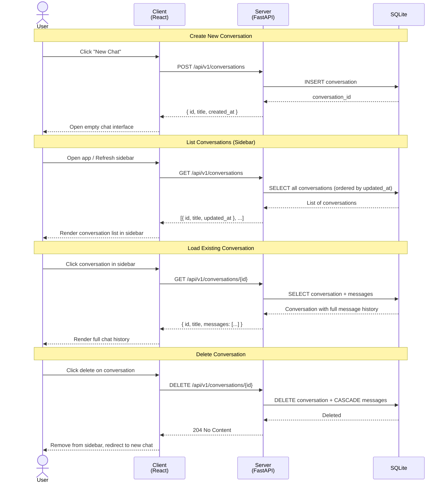

# LawyerGPT — Flow & Sequence Diagrams

---

## 1. User Flow Diagram

---

## 2. Sequence Diagram — Document Upload (Ingestion)

---

## 3. Sequence Diagram — Chat Query (RAG Flow)

---

## 4. Sequence Diagram — Conversation Management

